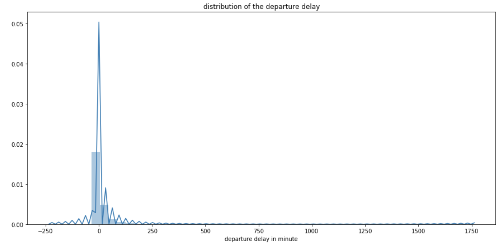

OVERVIEW:

This project is modeling delay of the flights of all US airports by using 18 millions of rows of data where each row
represents the each flight. Due to the running capacity problem of my pc and Python I only run data of top 5 busiest airpot and Boston Airport as 6th one. Total rows of the data for 6 airport is around 4 millions. For this step I run only for one airport in order to see how is the model score because of short time. when I deiced the which model is best then I will run the model for whole data on AWS which is cloud platform offers faster service in order to run the notebook.

As a former employee of aviation sector I expected the distribution of the delay would have Normal distribution but the distribution of the delay looks like the exponentially as you see below graph. 

There might be several reasons for any flight delay e.g., airport capacity( gate, slot , parking ) , carrier based delays, weather
conditions, destination air traffic condition. In this project I use as features scheduled flight time(year, month, weekday) , origin point, destination point, carrier name and Scheduled Departure Time.

DATA:

Flight data is downloaded from https://www.transtats.bts.gov/DL_SelectFields.asp?Table_ID=236 includes between 2016-March and 2019 February as monthly based.

DATA ANALYSIS AND PROCESSING:
I downloaded 36 months data and then merged as yearly where you can find under the 'yearly data' folder. if you want to check how I processed it you can check the 'steps for merging the data' text file as well.
The main notebook is 'American Aviation' which I did EDA, analysis and modeling in.

i scraped the historical weather conditions data and keep it in 'weather scrape' notebook. Data contains the hourly weather report for 3 years. For now I have only for ATL airport and I will scrape for the rest airports in Future Evaluation step.

DELAY FORECAST MODELS:
I use 7 categorical features which is equal to 223 dummy variables and over 1 million rows of data in order to run the prototyping.

1- Linear Regression:
Target is to predict exactly how many minutes will be delay for each flight. The R^2 of this model is %12 which is very bad.So I skipped this model for now.

2- Classification Model:
I classified each 15 delay minutes as a class which is between -2 and 12. Minus classes represent earlier take off, zero represents the delay between 0 and 14 minutes, 1 represents delay between 15 to 29 minutes and so on and the 12 represents delay more than 180 minutes. The target of the model is to predict the delay for each flight is which category for.

Logistic Regression, Decision Tree, AdaBoost SVC are used to predict the target. Decision Tree is overfitting , SVC takes to much time to run. Logistic or AdaBoost are convenient to use as modeling. Except the Decision Tree the rest of the models predict the baseline for now. The reason why could be no much features to make the complicate the models. So I decide to add new features like weather and aircraft type. For now I succeeded to scrape weather conditions for ATL airport during past the 3 years. Next step is looking for the aircraft type and age. As I guess if I add these features to model then I will overcome the dominant predictor issue.

SUMMARY:
The issue of the data is the dominant predictor and it needs to add new features to model in order to improve the model. 
The first step is adding the hourly based weather conditions info and next step is adding the aircraft information ( fleet type, age etc). 

FUTURE EVALUATION:
Currently I am working on the weather conditions data and will work on aircraft data. I will check all models above mentioned by adding these new features and will decide on which model is the best one. Then I will upload all data to notebook and will run the 
best model at AWS. 

Footnote: the files contain more than the 100 MB data size didn't upload the GitHub because of the large size!